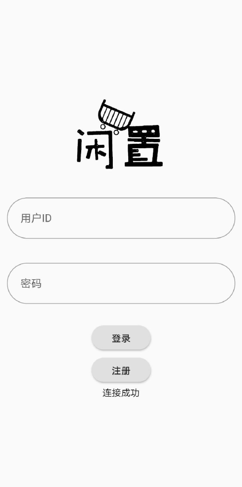
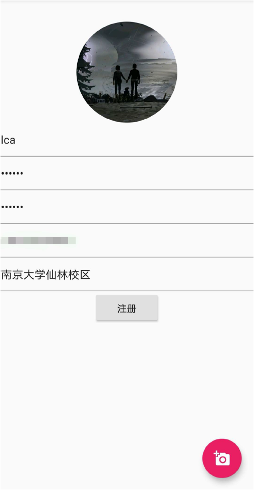
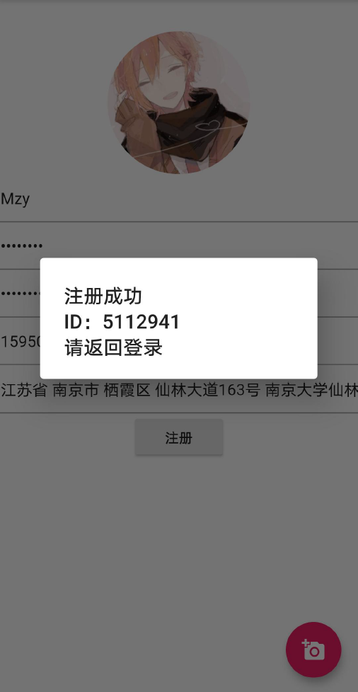
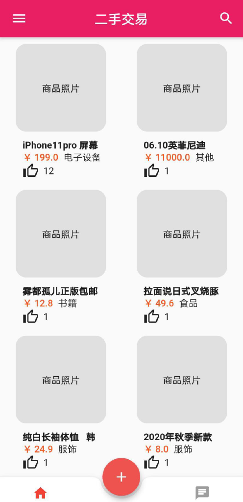
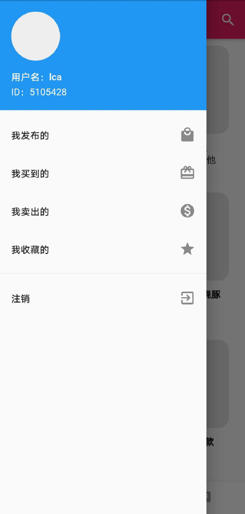
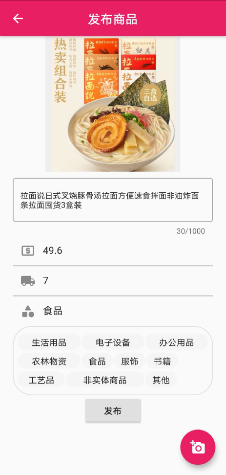
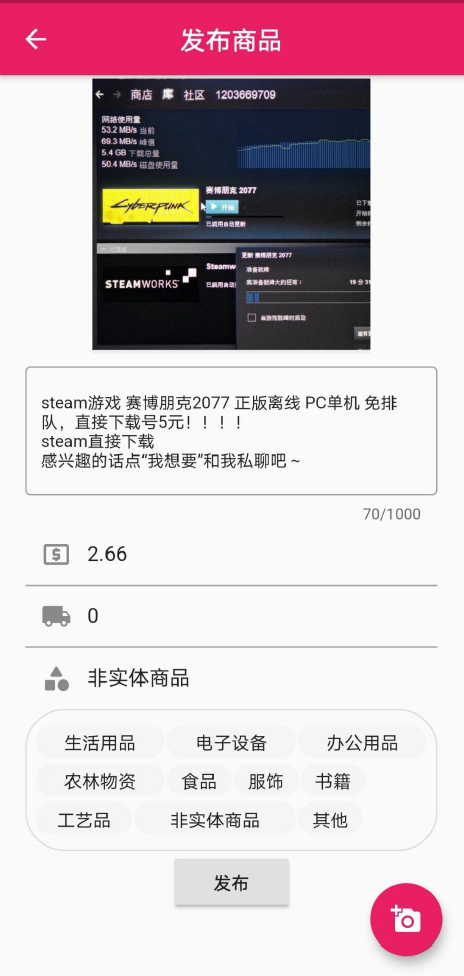
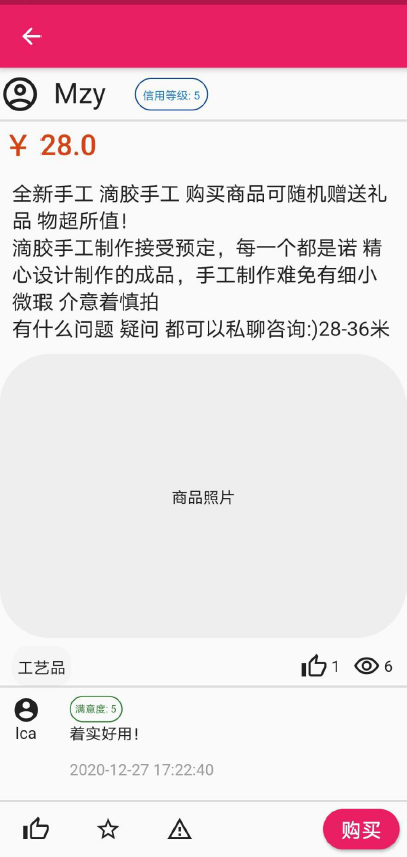

# NJU-PROJECT-XIANZHI

A Flutter project for class Database and Information System.

二手交易app 

## 页面展示

#### 登陆界面&注册界面

</img> </img> </img>

#### 主界面

</img> </img>

#### 商品发布页&商品界面

</img> </img> </img>

#### 搜索界面

</img> </img> </img>

#### 收藏&举报&购买界面

</img> </img> </img>

#### 聊天页面

</img> </img>

#### 我的发布&我的买到&我的卖出

</img> </img> </img>

#### 订单细则&商品修改页

</img> </img> </img>

#### 我收藏的

</img> </img>
